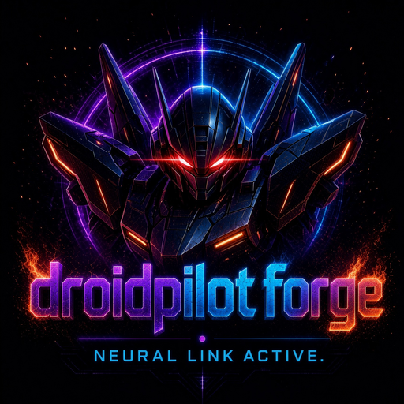

<p align="center">
  
</p>

<h1 align="center">DroidPilot Forge</h1>

<p align="center"><em>An enhanced, agentic evolution of DroidPilot.</em></p>

<p align="center">
  <a href="https://opensource.org/licenses/MIT"></a>
  <a href="https://developer.android.com"></a>
  <a href="https://modelcontextprotocol.io"></a>
  <a href="https://kotlinlang.org"></a>
</p>

---

DroidPilot Forge lets an AI agent operate a real Android device: it reads the on-screen UI
tree through Android's Accessibility APIs and acts on it through OS gesture dispatch, over
an authenticated, encrypted connection. No ADB, no USB, no screen mirroring, no OCR.

It is a modified and expanded version of [DroidPilot](#attribution), rebuilt around a
security core that treats privileged operations as something a device owner authorises
explicitly rather than something a paired connection implies.

> **Read the status column before you read the feature list.** This project distinguishes
> what is implemented and tested from what is designed but not yet wired up. That
> distinction is kept honest deliberately — see [Implementation status](#implementation-status).

## Contents

- [What it does today](#what-it-does-today)
- [Implementation status](#implementation-status)
- [How it works](#how-it-works)
- [Quick start](#quick-start)
- [MCP tools](#mcp-tools)
- [Security model](#security-model)
- [Authorization core](#authorization-core)
- [Privileged and root operations](#privileged-and-root-operations)
- [Operating modes](#operating-modes)
- [Building from source](#building-from-source)
- [Project structure](#project-structure)
- [Testing](#testing)
- [Limitations](#limitations)
- [Roadmap](#roadmap)
- [Documentation](#documentation)
- [Contributing](#contributing)
- [License](#license)
- [Attribution](#attribution)

---

## What it does today

An MCP-compatible agent — Claude Desktop, Claude Code, or anything else speaking the
protocol — connects to the Android app over your local network and drives the device:

```
Open Chrome and search for the weather
Find the search bar and type "hello world"
Scroll down and tell me what you see
Press the back button
```

The agent receives **structured, labelled UI elements**, not an image it has to interpret.
That is more reliable than OCR over screenshots and roughly two orders of magnitude cheaper
in tokens.

| Approach | Reliability | Speed | Token cost | Setup |
|---|---|---|---|---|
| ADB-based | Low — connection drops, limited UI access | Medium | High (screenshot analysis) | USB / Wi-Fi ADB |
| Screen mirroring + OCR | Low — OCR errors, high latency | Slow | Very high | Complex |
| **DroidPilot Forge** | **High — native OS integration** | **Fast** | **Low (structured data)** | **Install APK** |

---

## Implementation status

Every row below was verified by reading the code in this repository. Nothing is marked
implemented because it was planned.

### Implemented and tested

| Capability | Evidence |
|---|---|
| Android UI automation (tree, selectors, gestures, text, keys, app launch) | 18 instrumented tests on a real emulator |
| Screen capture with size caps | Instrumented |
| Authenticated connection (256-bit pairing secret, checked during HTTP upgrade) | Unit + instrumented |
| AES-256-GCM encrypted transport with replay rejection | Unit + instrumented, cross-checked against the Node implementation |
| Pairing-secret storage in hardware-backed Android Keystore | 8 instrumented tests against the real keystore |
| MCP server and tool surface | Unit tested against a protocol-accurate fake device |
| Honest capability reporting from the live service | Instrumented |

### Implemented and reachable from the app

The authorisation core now sits on the command path. A `shell` or `shell_root` command from
a paired client is refused unless the owner has granted the matching permission in the app,
and the refusal happens before anything runs.

| Component | Evidence |
|---|---|
| `RemotePermission` — ten permissions plus `AI_ROOT` | Unit tested |
| `AuthorizationManager` — single decision point, recomputed per command | 27 tests |
| `Grant` / `GrantDuration` — once, timed, until-revoked, with revocation | Unit tested |
| `PersistentGrantStore` — grants and revocations survive a restart | 15 tests |
| `DeviceIdentity` — identity derived from the pairing secret | 10 tests |
| `RequestGuard` — request-level replay and clock-skew rejection, bounded | 13 tests |
| `RootManager` — provider-agnostic elevated-shell detection | Unit tested |
| `RootCommandHandler` — the ordered authorisation sequence | 24 tests |
| `PrivilegedCommandGateway` + dispatcher wiring | 22 tests, end to end from a wire request |
| `AuditLogger` — privileged-operation trail, sizes not contents | 9 tests |
| Owner UI for granting, revoking access | 5 instrumented tests, against the real dialog and a real device identity |
| Owner UI for reviewing the audit trail | Not covered by an automated test — see [Limitations](#limitations) |
| `AppMode` / `AppModeStore` — Pilot vs Developer & Agent preference, persisted across restarts | Unit tested |
| `ActionStatus` — standardised command outcome (`SUCCESS`/`FAILED`/`BLOCKED`/`REQUIRES_PERMISSION`/`RETRYABLE`/`REQUIRES_USER`), mapped from every `ErrorCode` | Unit tested |
| `ExecutionTracker` — bounded, in-memory history of dispatched commands for the execution panel | Unit tested |
| `CommandDispatcher` reporting `mode` in `get_capabilities` and recording every non-polling command into `ExecutionTracker` | Unit tested, 9 tests |
| Owner UI — Pilot / Developer & Agent toggle and the execution-history panel it reveals | Not covered by an automated test — see [Limitations](#limitations) |

Those 22 wiring tests assert on whether a command *ran*, not on what a decision object said.
Removing the authorisation check from the handler turns 18 tests red across the suite, which
is the property that makes them worth having.

### Not implemented

Designed or discussed, but absent from the codebase. Do not rely on any of it.

| Capability | Status |
|---|---|
| Developer/Agent Mode's own plan/execute/observe/verify/replan loop, and an autonomous build/test/fix cycle | Planned — see [Operating modes](#operating-modes) below |
| Device-to-device pairing (a second phone as a peer) | Planned — a single identity, derived from the pairing secret, exists today |
| Remote device control (device A → device B) | Planned |
| Remote command bus / offline queue | Planned |
| Interactive root sessions | Planned |
| Root automations | Planned |
| Knowledge graph | Planned |
| On-device AI provider, model routing, context engine, token budgets | Planned |
| Persistent database and migrations | Planned |
| Remote UI / Developer UI | Planned |
| APK installation from within the app | Not feasible without device-owner or root — see [Limitations](#limitations) |

---

## How it works

```
┌──────────────┐   MCP / stdio   ┌──────────────┐   WebSocket    ┌─────────────────────┐
│  AI agent    │ ◄─────────────► │  MCP server  │ ◄────────────► │  Android device     │
│  (Claude, …) │                 │  (Node.js)   │  authenticated │  Accessibility svc  │
│              │                 │              │   + encrypted  │  + control server   │
└──────────────┘                 └──────────────┘                └─────────────────────┘
```

The agent is the model on the far end of the socket. The Android app is a transport and an
execution surface, not an agent runtime — there is no model running on the device.

---

## Quick start

### 1. Build and install the app

**Requirements:** Android 11+ (API 30), and a computer on the same network.

```bash
cd android
./gradlew assembleDebug
adb install app/build/outputs/apk/debug/app-debug.apk
```

Or open `android/` in Android Studio.

Then on the device:

1. Open **DroidPilot Forge**.
2. Tap **Open Accessibility settings** and enable the service.
3. Return to the app and tap **Start server**.
4. Tap **Copy pairing URI**. You now have a string like
   `droidpilot://192.168.1.42:8765#<secret>`.

> The pairing secret is what protects your device. Anyone holding it can read your screen
> and control the device while the server is running. Treat it like your lock-screen PIN.
> You can regenerate it at any time from the app.

### 2. Build the MCP server

```bash
cd mcp-server
npm install
npm run build
```

### 3. Configure your MCP client

**Claude Desktop** — add to `claude_desktop_config.json`; **Claude Code** — add to your MCP
settings. Same shape for both:

```json
{
  "mcpServers": {
    "droidpilot": {
      "command": "node",
      "args": ["/absolute/path/to/droidpilot/mcp-server/dist/index.js"]
    }
  }
}
```

The server key stays `droidpilot` so existing client configurations keep working.

### 4. Connect

```
Connect to my Android device: droidpilot://192.168.1.42:8765#<secret>
```

---

## MCP tools

| Tool | Description |
|---|---|
| `connect` | Connect using a pairing URI, or host + port + secret |
| `disconnect` | Disconnect from the device |
| `get_device_info` | Model, Android version, screen size, and granted capabilities |
| `get_ui_tree` | Full UI hierarchy as structured data — **prefer this over `screenshot`** |
| `find_element` | Search by text, resource id, class name or content description |
| `click_element` | Find and click — **prefer this over `tap`**; survives layout changes |
| `long_click_element` | Find and long-press, for context menus |
| `wait_for_element` | Wait for an element to appear, with a timeout |
| `screenshot` | Capture the screen as JPEG (expensive; use only when you must see rendering) |
| `tap` / `long_press` | Act on absolute coordinates, for canvases and maps |
| `swipe` / `scroll` / `pinch` | Gestures |
| `type_text` / `set_text` | Append to, or replace, the focused input field |
| `press_key` | back, home, recents, notifications, quick_settings, power_dialog, split_screen, lock_screen, take_screenshot |
| `open_app` | Launch an app by package name |
| `get_focused` | Describe the currently focused input element |
| `shell` | Run an unprivileged shell command — **requires a `REMOTE_SHELL` grant** |
| `shell_root` | Run a command as root — **requires both `REMOTE_ROOT` and `AI_ROOT`** |

### A note on screenshots

Prefer `get_ui_tree` and `find_element`. A UI dump is structured, exact, searchable, and far
cheaper in tokens than an image. Reach for `screenshot` only when you genuinely need to
*see* rendering — images, charts, canvas content with no accessibility representation.
Android also rate-limits captures to about one per second.

---

## Security model

Every connection is authenticated with a 256-bit pairing secret and encrypted with
AES-256-GCM. The secret is verified **during the HTTP upgrade**, so an unauthenticated peer
never reaches a state in which it could send a command. It is stored wrapped by a
hardware-backed Android Keystore key and excluded from backups.

Records are numbered with a strictly increasing counter, so a replayed or reordered record
is rejected rather than re-executed. Password fields are never transmitted, and typed text
is never echoed back or logged.

Full construction and threat model: **[SECURITY.md](SECURITY.md)**.

### Reducing exposure further

Enable **Loopback only** in the app and tunnel over ADB:

```bash
adb forward tcp:8765 tcp:8765
```

The server is then unreachable from the network entirely; connect to `127.0.0.1`.

---

## Authorization core

Every privileged command goes through this sequence. Nothing else in the app can reach an
elevated shell: `RootManager` is the only class that elevates, and the only caller that
reaches it from the network is the handler behind the command gateway.

```
Device identity
      ↓
Pairing            ← establishes identity; grants nothing
      ↓
Authentication     ← pairing secret, during the connection upgrade
      ↓
Authorization      ← recomputed from stored grants, on every command
      ↓
Permission         ← one enum, no shadow system
      ↓
Command validation ← replay, clock skew, shape
      ↓
Execution
      ↓
Audit logging      ← sizes, never contents
```

**Identity is derived, not asserted.** A peer never sends a device id. There is one pairing
secret, so there is one identity a peer can hold, and it is a hash of that secret. One
consequence is worth knowing: **regenerating the pairing secret voids every grant**, because
the identity they are keyed to stops existing. That is the fastest way to revoke everything.

The permissions that exist in code:

| Permission | Meaning | Privileged |
|---|---|---|
| `REMOTE_VIEW` | Read device status, capabilities and metadata | no |
| `REMOTE_KNOWLEDGE` | Search and read the knowledge graph *(the graph itself is not implemented)* | no |
| `REMOTE_AUTOMATION` | Start and stop automations | yes |
| `REMOTE_AI` | Ask the on-device AI subsystem questions *(subsystem not implemented)* | yes |
| `REMOTE_FILES` | Read and write files the app can reach | yes |
| `REMOTE_SETTINGS` | Change the app's own settings | yes |
| `REMOTE_TERMINAL` | Open an interactive unprivileged shell session | yes |
| `REMOTE_SHELL` | Execute unprivileged shell commands | yes |
| `REMOTE_ROOT` | Execute commands as root | yes |
| `AI_ROOT` | A **second** gate, required when the AI rather than a person initiates a root command | yes |

Properties the code enforces, each covered by tests:

- **Pairing is not authorization.** Pairing establishes identity and confers nothing.
- **A grant is not a token the requester holds.** It is a record the device re-reads on
  every command, so revocation takes effect on the next command rather than when some
  cached credential lapses.
- **No preset confers root.** Trust levels expand into individual grants at the moment they
  are applied and are never consulted at execution time. No preset — including the one named
  `ROOT` — includes `REMOTE_ROOT` or `AI_ROOT`.
- **`REMOTE_SHELL` ≠ `REMOTE_ROOT` ≠ `AI_ROOT`.** An AI-initiated root command needs both
  `REMOTE_ROOT` and `AI_ROOT`; holding one never implies the other.
- **Single-use means single-use.** A `Once` grant is consumed on use — including the
  `AI_ROOT` gate, which is spent alongside the root grant it authorises.
- **Replay is rejected before authorization**, so a resent request cannot spend a
  single-use grant simply by arriving twice.

---

## Privileged and root operations

**DroidPilot Forge cannot root a device.** It can *use* elevated access that the device
already provides, when the owner explicitly authorises the operation. On a device with no
root provider, the app says so plainly rather than failing later at the point of use.

Root detection is provider-agnostic: there is no check for any particular root manager, no
hard-coded binary path, and no assumption about which implementation is installed. The probe
asks whether an elevated shell can actually be obtained (`id -u` returning `0`) and reports
what answered.

There is deliberately **no blocklist of dangerous commands**. Once an owner has explicitly
authorised root for a device, root commands from it are the feature working as intended; a
blocklist would refuse legitimate administration while stopping nobody who can write the
same thing another way, and its real cost is worse — it invites the belief that the list is
the security boundary. The boundary is owner authorisation, device identity, and a live
grant.

Design and rationale: **[ROOT_AUTHORIZATION.md](ROOT_AUTHORIZATION.md)**.

---

## Operating modes

Two modes are the project's intended shape. One exists; one does not.

### Pilot Mode — *implemented*

> *"Tell me what to do on this Android device, and I'll do it."*

Direct device operation: launching apps, navigating interfaces, reading the UI tree,
locating elements, dispatching gestures and text, pressing system keys, capturing the
screen. This is what the app does today, and it is covered by instrumented tests that run on
a real emulator in CI.

### Developer Mode — *the device-side half is implemented; the loop itself is not*

> *"Give me an objective, and I'll plan, build, test, diagnose, fix, and iterate."*

The intended workflow:

```
Objective → Analyze → Plan → Inspect → Modify → Build → Install → Test → Diagnose → Fix → Rebuild → Retest
```

**What exists today:** a device-side `AppMode` the owner can switch (`core/mode/AppMode.kt`),
persisted across restarts, reported to a connected client via `get_capabilities.mode`. When
Developer & Agent is selected, the app shows a live execution-history panel: every dispatched
command, whether it succeeded, and — via a details dialog — its error when it failed. Every
command's outcome is classified into one of six standardised statuses (`SUCCESS`, `FAILED`,
`BLOCKED`, `REQUIRES_PERMISSION`, `REQUIRES_USER`, `RETRYABLE` — see `agent/ActionStatus.kt`),
so a client can decide whether to retry, ask the owner, or stop.

**What does not exist:** switching modes does not run a plan/execute/observe/verify/replan
loop on the device, and there is no autonomous build/test/fix cycle anywhere in this
repository. One constraint shapes why that loop, when it exists, will not live entirely
on-device: Android ships no JDK, no Gradle and no compiler, and this app cannot install an
APK without device-owner or root privileges. A build loop therefore has to run on a host with
the toolchain and the repository — this is exactly the shape DroidPilot Forge already has,
since the agent is the MCP client on the other end of the socket, not a model on the device.
Developer/Agent Mode's job on the *device* side is to make that external agent's objective
loop legible to the owner (what ran, what happened) and to keep every step it takes subject to
the same authorisation core Pilot Mode uses — not to run the loop itself.

---

## Building from source

**Prerequisites**

| Requirement | Version |
|---|---|
| JDK | 17 |
| Android SDK | compileSdk 35 |
| Android Gradle Plugin | 8.7.3 (via the Gradle wrapper) |
| Kotlin | 2.0.21 |
| minSdk / targetSdk | 30 / 35 |
| Node.js | 20+ (MCP server) |

**Android**

```bash
cd android
./gradlew testDebugUnitTest        # unit tests
./gradlew lintDebug lintRelease    # lint (abortOnError is on)
./gradlew assembleDebug            # debug APK
./gradlew assembleRelease          # release APK — unsigned unless credentials are supplied
./gradlew bundleRelease            # release AAB (Play Console upload format)
./gradlew connectedDebugAndroidTest # instrumented tests (needs a device or emulator)
```

APK/AAB output paths:

```
android/app/build/outputs/apk/debug/app-debug.apk
android/app/build/outputs/apk/release/app-release.apk            # signed build
android/app/build/outputs/apk/release/app-release-unsigned.apk   # unsigned build (no credentials)
android/app/build/outputs/bundle/release/app-release.aab
```

Release signing is read from the environment variables `DROIDPILOT_KEYSTORE` (path to the
`.jks`/`.keystore` file), `DROIDPILOT_KEYSTORE_PASSWORD`, `DROIDPILOT_KEY_ALIAS` and
`DROIDPILOT_KEY_PASSWORD`, or from a local `keystore.properties` (`storeFile`, `storePassword`,
`keyAlias`, `keyPassword`) — see `android/app/build.gradle.kts`. Without them the release
variant builds **unsigned** — it still exercises R8 and resource shrinking, but cannot be
installed. See [CONTRIBUTING.md](CONTRIBUTING.md).

Every push runs `.github/workflows/ci.yml`, which builds all three (debug APK, release
APK, release AAB), stages them under `android/staging/` with stable names
(`DroidPilot-debug.apk`, `DroidPilot-release.apk`, `DroidPilot-release.aab`,
`SHA256SUMS.txt`) and uploads them as a build artifact. Pushing a tag matching `v*.*.*` runs
`.github/workflows/release.yml`, which does the same build and attaches the results to a
**draft** GitHub Release for that tag — signed if the repository has
`ANDROID_KEYSTORE_BASE64`, `ANDROID_KEYSTORE_PASSWORD`, `ANDROID_KEY_ALIAS` and
`ANDROID_KEY_PASSWORD` configured as secrets, clearly labelled unsigned otherwise. The
workflow does not publish the release automatically; a maintainer reviews and publishes the
draft.

**MCP server**

```bash
cd mcp-server
npm install
npm run typecheck
npm test
npm run build
```

---

## Project structure

```
droidpilot/
├── android/
│   └── app/src/
│       ├── main/kotlin/com/mobilemcp/pro/
│       │   ├── automation/      # DeviceAutomator contract, UI node model, selectors
│       │   ├── core/            # OperationResult, capabilities, network addresses
│       │   │   ├── audit/       # AuditLogger
│       │   │   ├── identity/    # Device identity, derived from the pairing secret
│       │   │   ├── permission/  # Authorization core + persistent grant store
│       │   │   └── root/        # Root detection + shell execution
│       │   ├── protocol/        # Wire protocol and serializers
│       │   ├── security/        # Pairing secret, secure channel, auth gate
│       │   ├── server/          # Control server, command dispatcher
│       │   ├── service/         # Accessibility service, foreground service
│       │   └── ui/              # MainActivity
│       ├── test/                # JVM unit tests
│       └── androidTest/         # Instrumented tests (real device / emulator)
├── mcp-server/                  # TypeScript MCP server
│   ├── src/                     # Client, secure channel, tools, server
│   └── test/                    # Tests incl. a protocol-accurate fake device
├── docs/images/                 # Documentation assets
├── .github/workflows/ci.yml     # Build, test, lint, emulator, MCP server
├── ARCHITECTURE.md
├── SECURITY.md
├── ROOT_AUTHORIZATION.md
├── PHASE_2_ARCHITECTURE.md
├── CONTRIBUTING.md
├── CHANGELOG.md
├── LICENSE
└── README.md
```

---

## Testing

CI runs three jobs on every push: unit tests + lint + both APKs, instrumented tests on an
API 30 emulator, and the MCP server's typecheck/test/build.

The instrumented suite matters more than its size suggests. Accessibility node walking,
gesture dispatch, screen capture and the Android Keystore round trip cannot be meaningfully
faked off-device — Robolectric was evaluated for this and rejected, because its
`AccessibilityNodeInfo` shadow returns `childCount = 0` and it reports
`AndroidKeyStore not found`. Tests written against it would assert on fixtures while
appearing to cover the riskiest code in the project.

---

## Limitations

Stated plainly, because each one is a thing the project cannot do rather than has not done
yet:

- **It cannot root a device.** It uses elevated access a device already provides.
- **It cannot install APKs from within the app.** Android requires device-owner or root
  privileges for silent installation, and there is no ADB-to-self.
- **It cannot read notifications.** That needs a `NotificationListenerService`, which this
  build does not ship. The capability is reported as unavailable with that reason rather
  than silently returning nothing.
- **It cannot run a build toolchain on-device.** Android ships no JDK, Gradle or compiler.
- **The pairing secret is the entire authority.** Anyone holding it is indistinguishable
  from the legitimate client. There is no forward secrecy: traffic recorded now can be
  decrypted by someone who learns the secret later. Regenerating the secret bounds that.
- **The owner-facing audit-trail review screen has no automated test.** Granting and
  revoking access through the app is now covered by instrumented tests against a real
  device identity; the dialog that lists past privileged operations is not.
- **`AI_ROOT` is a policy control, not a boundary against a hostile client.** It rests on the
  `initiator` field, which the peer supplies. DroidPilot's own MCP server declares every
  command as AI-initiated, which is the truth and makes the gate meaningful — but a client
  that holds the pairing secret and chooses to lie can already do anything the secret
  permits.
- **Screen capture is rate-limited by Android** to roughly one per second.

---

## Roadmap

**Completed** — verified by tests in this repository

- Accessibility-based device automation (Pilot Mode)
- Authenticated, encrypted, replay-resistant transport
- Keystore-backed pairing secret
- MCP server and tool surface
- Authorization, root-detection and audit components, wired into the command path
- Authorised `shell` and `shell_root` commands, denied by default
- Persistent grants, and an owner UI to grant, revoke and review
- Pilot / Developer & Agent mode switching, persisted, reported via `get_capabilities`
- Standardised command-outcome classification (`ActionStatus`) and an in-app execution
  history for Developer/Agent mode
- Release AAB build (`bundleRelease`) and a tag-triggered draft-release workflow with
  checksums, alongside the existing per-push CI build

**In development**

- Persistence for the audit trail (grants now persist; the trail is still in-memory)

**Planned**

- Developer/Agent Mode's own plan/execute/observe/verify/replan loop (today the device side
  reports mode and shows execution history; the loop itself runs in the off-device MCP
  client, unchanged)
- An autonomous build/test/fix cycle, hosted off-device
- Device identity and device-to-device pairing
- Remote device control and command bus, with an offline queue
- Root sessions and root automations
- Knowledge graph
- AI provider abstraction, context retrieval and token budgeting
- Remote and Developer UIs
- Vision (screenshot + vision-model analysis as a fallback to the UI tree), memory, voice,
  notification reading, and a routines/automations system — all evaluated against OpenDroid
  as a reference and intentionally deferred; see the note in CONTRIBUTING.md

---

## Documentation

| Document | Contents |
|---|---|
| [ARCHITECTURE.md](ARCHITECTURE.md) | Layering, design decisions, testing strategy, limitations |
| [SECURITY.md](SECURITY.md) | Authentication, encryption, permissions, threat model |
| [ROOT_AUTHORIZATION.md](ROOT_AUTHORIZATION.md) | The root authorisation rules, grant durations, what is deliberately absent |
| [PHASE_2_ARCHITECTURE.md](PHASE_2_ARCHITECTURE.md) | Audit of what exists, and the ordering for the remaining work |
| [CONTRIBUTING.md](CONTRIBUTING.md) | Building, testing, release signing, conventions |
| [CHANGELOG.md](CHANGELOG.md) | Release history |

---

## Tech stack

- **Android:** Kotlin 2.0, Coroutines, kotlinx.serialization, Material 3, Java-WebSocket
- **MCP server:** TypeScript, Node 20+, `@modelcontextprotocol/sdk`
- **Transport:** WebSocket, authenticated and encrypted with AES-256-GCM

---

## Contributing

Contributions welcome — see [CONTRIBUTING.md](CONTRIBUTING.md).

If you add a feature, add it to the [status table](#implementation-status) with the evidence
that it works. A row that claims more than the code delivers is a bug in this README.

---

## License

[MIT](LICENSE).

---

## Attribution

DroidPilot Forge is a modified and expanded version of the **DroidPilot** project, with
additional architecture and security work: an authorisation core, provider-agnostic root
detection, an audit trail, and an instrumented test suite that runs on real Android.

The original DroidPilot is MIT licensed, Copyright (c) 2026 youichi-uda. That copyright
notice and the MIT permission notice are preserved in [LICENSE](LICENSE), as the licence
requires. The Android application id remains `com.mobilemcp.pro` so that existing
installations upgrade in place and keep their Accessibility grant and pairing secret.
